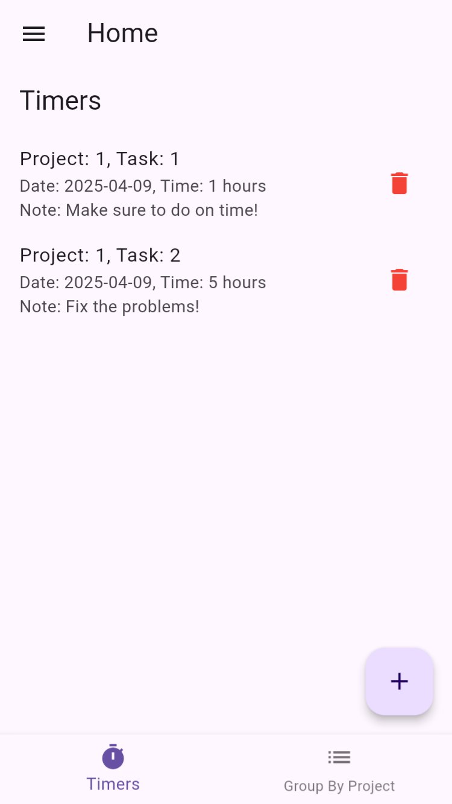
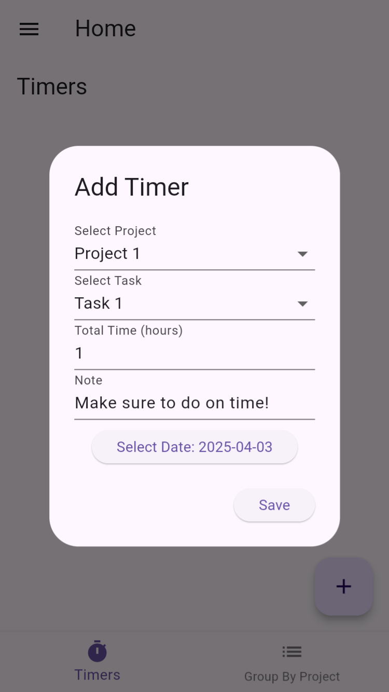
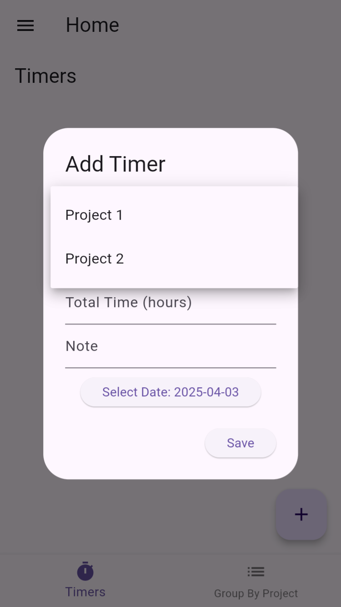
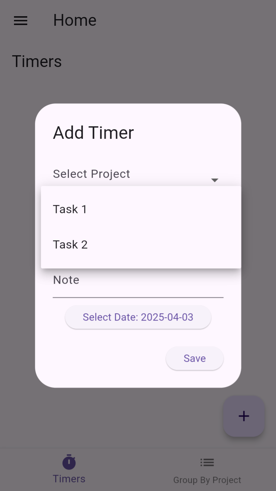
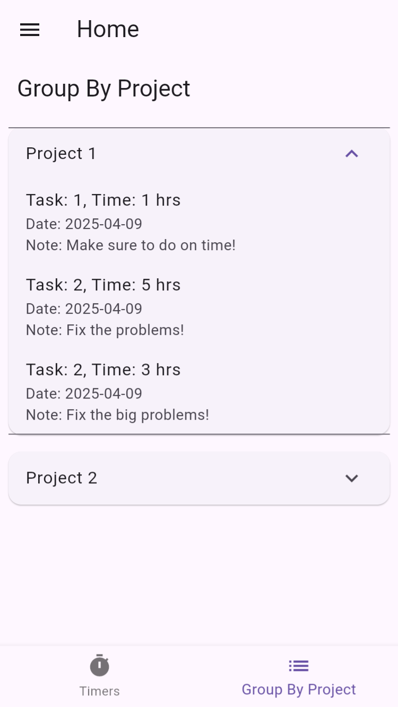
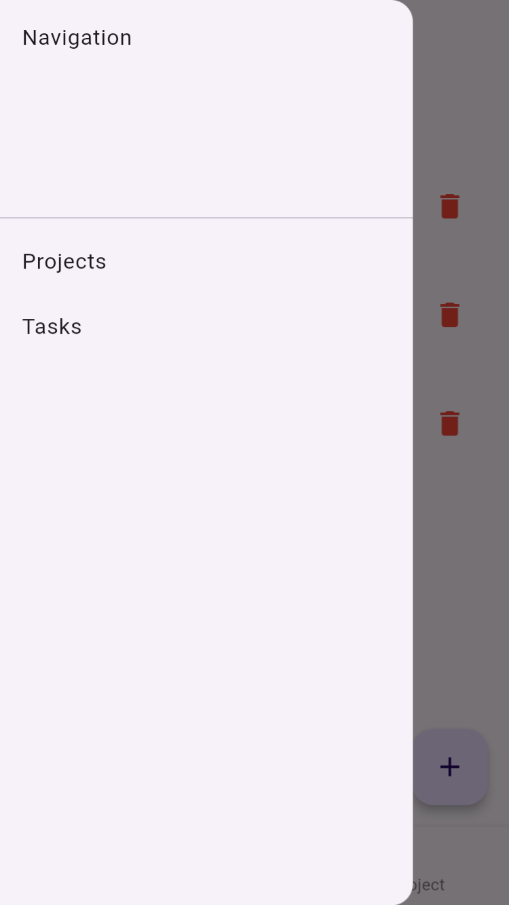
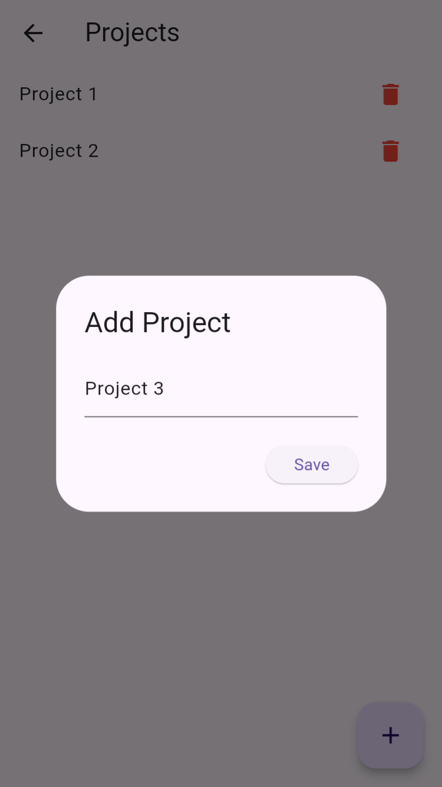
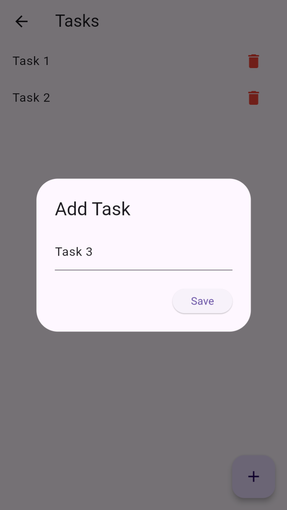
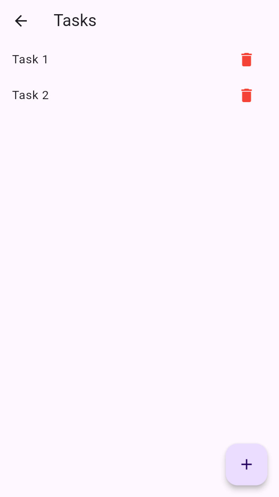

# Title
Project Management App

# Description
A sleek and intuitive project management app built with Flutter. Easily create projects, assign tasks, track progress, and collaborate with team members in real-time.
Ideal for individuals, startups, and teams aiming to stay organized and productive.

# Features
`▪ Project & task creation`

`▪ Progress tracking & status boards`
  
`▪ Task creation, assignment, and deadlines`

# Technologies Used

# Screenshots

  
  
  

  
  
  

  
  
  

